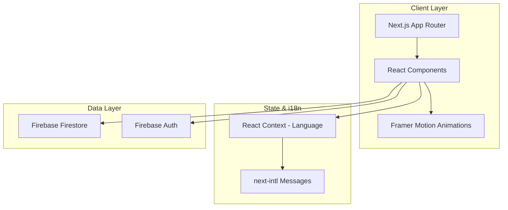

# Design Document

## Overview

Платформа обмена криптовалют — современное веб-приложение на Next.js 14 с App Router, использующее Firebase Firestore для хранения данных. Приложение включает публичную часть (главная, отзывы, контакты) и защищённую админ-панель.

### Технологический стек

- **Frontend**: Next.js 14 (App Router), React 18, TypeScript
- **Styling**: Tailwind CSS
- **Animations**: Framer Motion
- **Database**: Firebase Firestore
- **Authentication**: Firebase Auth (для админ-панели)
- **i18n**: next-intl для мультиязычности
- **Icons**: Lucide React

## Architecture




### Структура страниц

```mermaid
graph LR
    subgraph "Public Pages"
        A[/ - Главная]
        B[/reviews - Отзывы]
        C[/contacts - Контакты]
    end
    
    subgraph "Admin Pages"
        D[/admin - Dashboard]
        E[/admin/coins - Монеты]
        F[/admin/payments - Реквизиты]
        G[/admin/reviews - Отзывы]
    end
```

## Components and Interfaces

### Публичные компоненты

```typescript
// components/Header.tsx
interface HeaderProps {
  currentLang: 'ru' | 'en';
  onLanguageChange: (lang: 'ru' | 'en') => void;
}

// components/CoinCard.tsx
interface CoinCardProps {
  coin: Coin;
  index: number; // для staggered анимации
}

// components/ReviewCard.tsx
interface ReviewCardProps {
  review: Review;
  index: number;
}

// components/ContactForm.tsx
interface ContactFormProps {
  onSubmit: (data: ContactFormData) => Promise<void>;
}
```

### Админ компоненты

```typescript
// components/admin/CoinForm.tsx
interface CoinFormProps {
  coin?: Coin;
  onSave: (coin: Coin) => Promise<void>;
  onCancel: () => void;
}

// components/admin/PaymentForm.tsx
interface PaymentFormProps {
  payment?: PaymentDetails;
  coins: Coin[];
  onSave: (payment: PaymentDetails) => Promise<void>;
}
```


## Data Models

### Coin (Криптовалюта)

```typescript
interface Coin {
  id: string;
  name: string;           // "Bitcoin"
  symbol: string;         // "BTC"
  logoUrl: string;        // URL логотипа
  buyRate: number;        // Курс покупки в USD
  sellRate: number;       // Курс продажи в USD
  isActive: boolean;      // Активна ли монета
  createdAt: Timestamp;
  updatedAt: Timestamp;
}
```

### PaymentDetails (Реквизиты)

```typescript
interface PaymentDetails {
  id: string;
  type: 'bank' | 'crypto';
  
  // Для банковских реквизитов
  bankName?: string;
  accountNumber?: string;
  holderName?: string;
  
  // Для криптокошельков
  coinId?: string;        // Связь с Coin
  walletAddress?: string;
  network?: string;       // "ERC20", "TRC20", etc.
  
  isActive: boolean;
  createdAt: Timestamp;
  updatedAt: Timestamp;
}
```

### Review (Отзыв)

```typescript
interface Review {
  id: string;
  authorName: string;
  rating: number;         // 1-5
  text: string;
  date: Timestamp;
  isPublished: boolean;
  createdAt: Timestamp;
}
```

### ContactFormData

```typescript
interface ContactFormData {
  name: string;
  email: string;
  message: string;
}
```


## Firebase Collections Structure

```
firestore/
├── coins/
│   └── {coinId}/
│       ├── name: string
│       ├── symbol: string
│       ├── logoUrl: string
│       ├── buyRate: number
│       ├── sellRate: number
│       ├── isActive: boolean
│       ├── createdAt: timestamp
│       └── updatedAt: timestamp
│
├── payments/
│   └── {paymentId}/
│       ├── type: 'bank' | 'crypto'
│       ├── bankName?: string
│       ├── accountNumber?: string
│       ├── holderName?: string
│       ├── coinId?: string
│       ├── walletAddress?: string
│       ├── network?: string
│       ├── isActive: boolean
│       ├── createdAt: timestamp
│       └── updatedAt: timestamp
│
├── reviews/
│   └── {reviewId}/
│       ├── authorName: string
│       ├── rating: number
│       ├── text: string
│       ├── date: timestamp
│       ├── isPublished: boolean
│       └── createdAt: timestamp
│
└── contacts/
    └── {contactId}/
        ├── name: string
        ├── email: string
        ├── message: string
        └── createdAt: timestamp
```

## Animation Strategy

### Framer Motion Variants

```typescript
// Fade in with slide up
const fadeInUp = {
  initial: { opacity: 0, y: 20 },
  animate: { opacity: 1, y: 0 },
  transition: { duration: 0.5 }
};

// Staggered children
const staggerContainer = {
  animate: {
    transition: {
      staggerChildren: 0.1
    }
  }
};

// Hover scale effect
const hoverScale = {
  whileHover: { scale: 1.02 },
  whileTap: { scale: 0.98 }
};

// Page transitions
const pageTransition = {
  initial: { opacity: 0, x: -20 },
  animate: { opacity: 1, x: 0 },
  exit: { opacity: 0, x: 20 }
};
```


## Correctness Properties

*A property is a characteristic or behavior that should hold true across all valid executions of a system—essentially, a formal statement about what the system should do. Properties serve as the bridge between human-readable specifications and machine-verifiable correctness guarantees.*

### Property 1: Data Persistence Round-Trip

*For any* valid Coin, PaymentDetails, or Review object created through the admin panel, reading it back from the database should return an equivalent object with all fields preserved.

**Validates: Requirements 4.3, 5.2, 5.3, 6.2**

### Property 2: Delete Removes From System

*For any* Coin, PaymentDetails, or Review that is deleted through the admin panel, querying the database and public pages should not return that item.

**Validates: Requirements 4.5, 5.5, 6.3**

### Property 3: All Active Items Displayed

*For any* set of active Coins in the database, the main page should display all of them. *For any* set of published Reviews, the reviews page should display all of them.

**Validates: Requirements 1.2, 2.1, 4.2, 5.1, 6.1**

### Property 4: Review Display Contains Required Fields

*For any* Review object, the rendered review card should contain the author name, rating, date, and review text.

**Validates: Requirements 2.2**

### Property 5: Language Preference Persistence

*For any* language selection (ru or en), storing it and then retrieving from localStorage should return the same language value.

**Validates: Requirements 8.2, 8.3**

### Property 6: Contact Form Validation

*For any* contact form submission with empty required fields or invalid email format, the form should reject the submission and display validation errors.

**Validates: Requirements 3.3**

### Property 7: Exchange Rate Update Propagation

*For any* Coin whose exchange rate is updated in the admin panel, the public main page should display the updated rate.

**Validates: Requirements 4.4**

### Property 8: Payment Details Validation

*For any* PaymentDetails with invalid format (e.g., empty wallet address for crypto type, empty bank details for bank type), the admin panel should reject the save operation.

**Validates: Requirements 5.4**

### Property 9: Language Files Completeness

*For any* translation key used in the application, both Russian and English language files should contain a translation for that key.

**Validates: Requirements 8.1**


## Error Handling

### Client-Side Errors

| Error Type | Handling Strategy |
|------------|-------------------|
| Form validation | Display inline error messages below fields |
| Network errors | Show toast notification with retry option |
| Auth errors | Redirect to login with error message |
| Not found | Display 404 page with navigation back |

### Firebase Errors

```typescript
// lib/firebase-errors.ts
const handleFirebaseError = (error: FirebaseError): string => {
  switch (error.code) {
    case 'permission-denied':
      return 'Недостаточно прав для выполнения операции';
    case 'unavailable':
      return 'Сервис временно недоступен. Попробуйте позже';
    case 'not-found':
      return 'Запрашиваемые данные не найдены';
    default:
      return 'Произошла ошибка. Попробуйте позже';
  }
};
```

## Testing Strategy

### Unit Tests

- Test validation functions for forms
- Test data transformation utilities
- Test language switching logic
- Framework: Jest + React Testing Library

### Property-Based Tests

- Framework: fast-check
- Minimum 100 iterations per property test
- Each test tagged with: **Feature: crypto-exchange-platform, Property {N}: {description}**

### Integration Tests

- Test Firebase CRUD operations
- Test authentication flow
- Test real-time data sync

### E2E Tests (Optional)

- Playwright for critical user flows
- Admin panel CRUD operations
- Language switching persistence

## File Structure

```
src/
├── app/
│   ├── layout.tsx
│   ├── page.tsx                 # Главная
│   ├── reviews/
│   │   └── page.tsx
│   ├── contacts/
│   │   └── page.tsx
│   └── admin/
│       ├── layout.tsx
│       ├── page.tsx             # Dashboard
│       ├── coins/
│       │   └── page.tsx
│       ├── payments/
│       │   └── page.tsx
│       └── reviews/
│           └── page.tsx
├── components/
│   ├── Header.tsx
│   ├── Footer.tsx
│   ├── CoinCard.tsx
│   ├── ReviewCard.tsx
│   ├── ContactForm.tsx
│   ├── LanguageSwitcher.tsx
│   └── admin/
│       ├── AdminSidebar.tsx
│       ├── CoinForm.tsx
│       ├── PaymentForm.tsx
│       └── ReviewForm.tsx
├── lib/
│   ├── firebase.ts
│   ├── firestore.ts
│   └── validations.ts
├── hooks/
│   ├── useCoins.ts
│   ├── useReviews.ts
│   └── usePayments.ts
├── context/
│   └── LanguageContext.tsx
├── messages/
│   ├── ru.json
│   └── en.json
└── types/
    └── index.ts
```
