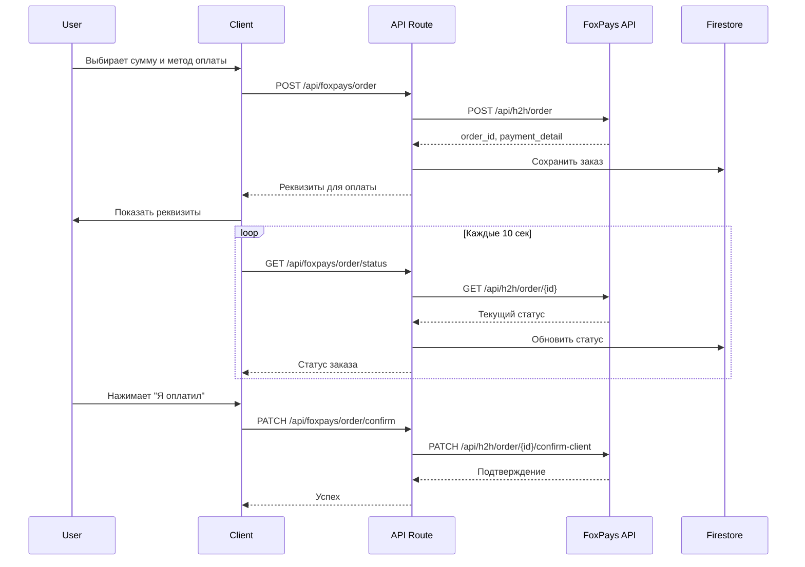

# Design Document

## Overview

Интеграция платежной системы FoxPays для динамического получения реквизитов при обмене криптовалют. Система использует H2H API для создания сделок и получения актуальных реквизитов (номер карты, телефон, QR-код).

### Технологический стек

- **Frontend**: Next.js 14 (App Router), React 18, TypeScript
- **Backend**: Next.js API Routes (server-side)
- **Database**: Firebase Firestore (хранение заказов)
- **External API**: FoxPays H2H API
- **State Management**: React hooks + polling

## Architecture

```mermaid
graph TB
    subgraph "Client Layer"
        A[Exchange Page]
        B[Order Status Page]
        C[Admin Settings]
    end
    
    subgraph "API Routes (Server-side)"
        D[/api/foxpays/gateways]
        E[/api/foxpays/order]
        F[/api/foxpays/order/status]
        G[/api/foxpays/order/confirm]
        H[/api/foxpays/order/cancel]
    end
    
    subgraph "External"
        I[FoxPays H2H API]
    end
    
    subgraph "Database"
        J[Firebase Firestore]
    end
    
    A --> D
    A --> E
    B --> F
    B --> G
    B --> H
    D --> I
    E --> I
    F --> I
    G --> I
    H --> I
    E --> J
    F --> J
```

### Поток создания заказа



## Components and Interfaces

### API Routes

```typescript
// app/api/foxpays/gateways/route.ts
// GET - получить доступные платежные методы
interface PaymentGateway {
  name: string;
  code: string;
  schema: string;
  currency: string;
  min_limit: string;
  max_limit: string;
  reservation_time: number;
  detail_types: ('card' | 'phone' | 'account_number' | 'qrcode')[];
}

// app/api/foxpays/order/route.ts
// POST - создать заказ
interface CreateOrderRequest {
  amount: number;
  currency: string;
  payment_gateway: string;
  external_id?: string;
  callback_url?: string;
}

interface CreateOrderResponse {
  order_id: string;
  amount: string;
  currency: string;
  status: 'pending' | 'success' | 'fail';
  sub_status: string;
  payment_gateway: string;
  payment_gateway_name: string;
  payment_detail: {
    detail: string;
    detail_type: 'card' | 'phone' | 'account_number' | 'qrcode';
    initials: string;
    qr_code_url?: string;
    qr_code_link?: string;
  };
  expires_at: number;
  created_at: number;
}
```

### React Components

```typescript
// components/PaymentGatewaySelector.tsx
interface PaymentGatewaySelectorProps {
  gateways: PaymentGateway[];
  selectedGateway: string | null;
  onSelect: (code: string) => void;
  amount: number;
}

// components/PaymentDetails.tsx
interface PaymentDetailsProps {
  order: CreateOrderResponse;
  onConfirm: () => void;
  onCancel: () => void;
}

// components/PaymentTimer.tsx
interface PaymentTimerProps {
  expiresAt: number;
  onExpire: () => void;
}

// components/CopyButton.tsx
interface CopyButtonProps {
  text: string;
  label?: string;
}
```

### Hooks

```typescript
// hooks/useFoxPaysGateways.ts
interface UseFoxPaysGatewaysReturn {
  gateways: PaymentGateway[];
  loading: boolean;
  error: string | null;
  refetch: () => void;
}

// hooks/useFoxPaysOrder.ts
interface UseFoxPaysOrderReturn {
  createOrder: (data: CreateOrderRequest) => Promise<CreateOrderResponse>;
  confirmPayment: (orderId: string) => Promise<void>;
  cancelOrder: (orderId: string) => Promise<void>;
  uploadReceipt: (orderId: string, file: File) => Promise<void>;
  loading: boolean;
  error: string | null;
}

// hooks/useOrderStatus.ts
interface UseOrderStatusReturn {
  status: OrderStatus | null;
  loading: boolean;
  error: string | null;
}
```

## Data Models

### FoxPaysConfig (Firebase)

```typescript
interface FoxPaysConfig {
  id: string;
  apiBaseUrl: string;
  accessToken: string; // Зашифрованный
  isEnabled: boolean;
  updatedAt: Timestamp;
}
```

### ExchangeOrder (Firebase)

```typescript
interface ExchangeOrder {
  id: string;
  
  // FoxPays данные
  foxpaysOrderId: string;
  externalId: string;
  
  // Сумма и валюта
  baseAmount: number;
  amount: number;
  currency: string;
  
  // Платежный метод
  paymentGateway: string;
  paymentGatewayName: string;
  
  // Реквизиты
  paymentDetail: {
    detail: string;
    detailType: 'card' | 'phone' | 'account_number' | 'qrcode';
    initials: string;
    qrCodeUrl?: string;
  };
  
  // Статус
  status: 'pending' | 'success' | 'fail';
  subStatus: string;
  
  // Криптовалюта (что покупает пользователь)
  coinId: string;
  coinSymbol: string;
  coinAmount: number;
  
  // Контакт пользователя
  userContact: string; // Telegram/Email
  
  // Временные метки
  expiresAt: number;
  finishedAt: number | null;
  createdAt: Timestamp;
  updatedAt: Timestamp;
}
```

### OrderStatusMap

```typescript
const ORDER_STATUS_MAP: Record<string, string> = {
  'pending': 'Ожидание',
  'success': 'Успешно',
  'fail': 'Ошибка',
};

const ORDER_SUB_STATUS_MAP: Record<string, string> = {
  'accepted': 'Закрыт вручную',
  'successfully_paid': 'Оплачен',
  'successfully_paid_by_resolved_dispute': 'Оплачен после спора',
  'waiting_details_to_be_selected': 'Ожидание реквизитов',
  'waiting_for_payment': 'Ожидание оплаты',
  'waiting_for_dispute_to_be_resolved': 'Спор на рассмотрении',
  'canceled_by_dispute': 'Отменен по спору',
  'expired': 'Истекло время',
  'cancelled': 'Отменен',
};
```

## Firebase Collections Structure

```
firestore/
├── settings/
│   └── foxpays/
│       ├── apiBaseUrl: string
│       ├── accessToken: string (encrypted)
│       ├── isEnabled: boolean
│       └── updatedAt: timestamp
│
└── orders/
    └── {orderId}/
        ├── foxpaysOrderId: string
        ├── externalId: string
        ├── baseAmount: number
        ├── amount: number
        ├── currency: string
        ├── paymentGateway: string
        ├── paymentGatewayName: string
        ├── paymentDetail: object
        ├── status: string
        ├── subStatus: string
        ├── coinId: string
        ├── coinSymbol: string
        ├── coinAmount: number
        ├── userContact: string
        ├── expiresAt: number
        ├── finishedAt: number | null
        ├── createdAt: timestamp
        └── updatedAt: timestamp
```

## API Routes Implementation

### FoxPays Client

```typescript
// lib/foxpays.ts
class FoxPaysClient {
  private baseUrl: string;
  private accessToken: string;
  
  constructor(baseUrl: string, accessToken: string) {
    this.baseUrl = baseUrl;
    this.accessToken = accessToken;
  }
  
  private async request<T>(
    method: string,
    endpoint: string,
    body?: object
  ): Promise<T> {
    const response = await fetch(`${this.baseUrl}${endpoint}`, {
      method,
      headers: {
        'Accept': 'application/json',
        'Content-Type': 'application/json',
        'Access-Token': this.accessToken,
      },
      body: body ? JSON.stringify(body) : undefined,
    });
    
    const data = await response.json();
    
    if (!data.success) {
      throw new Error(data.message || 'API Error');
    }
    
    return data.data;
  }
  
  async getCurrencies() {
    return this.request<Currency[]>('GET', '/api/currencies');
  }
  
  async getPaymentGateways() {
    return this.request<PaymentGateway[]>('GET', '/api/payment-gateways');
  }
  
  async createOrder(params: CreateOrderParams) {
    return this.request<H2HOrder>('POST', '/api/h2h/order', params);
  }
  
  async getOrder(orderId: string) {
    return this.request<H2HOrder>('GET', `/api/h2h/order/${orderId}`);
  }
  
  async confirmPayment(orderId: string) {
    return this.request<void>('PATCH', `/api/h2h/order/${orderId}/confirm-client`);
  }
  
  async cancelOrder(orderId: string) {
    return this.request<void>('PATCH', `/api/h2h/order/${orderId}/cancel`);
  }
  
  async uploadReceipt(orderId: string, file: File) {
    const formData = new FormData();
    formData.append('receipt', file);
    
    const response = await fetch(
      `${this.baseUrl}/api/h2h/order/${orderId}/receipt`,
      {
        method: 'POST',
        headers: {
          'Accept': 'application/json',
          'Access-Token': this.accessToken,
        },
        body: formData,
      }
    );
    
    const data = await response.json();
    if (!data.success) {
      throw new Error(data.message || 'Upload failed');
    }
  }
}
```

## UI Components Design

### Payment Gateway Selector

```
┌─────────────────────────────────────────────┐
│  Выберите способ оплаты                     │
├─────────────────────────────────────────────┤
│  ┌─────────┐  ┌─────────┐  ┌─────────┐     │
│  │ Сбербанк│  │Тинькофф │  │  СБП   │     │
│  │  ✓      │  │         │  │         │     │
│  └─────────┘  └─────────┘  └─────────┘     │
│                                             │
│  Лимиты: 1 000 - 100 000 ₽                 │
│  Время на оплату: 10 минут                  │
└─────────────────────────────────────────────┘
```

### Payment Details Card

```
┌─────────────────────────────────────────────┐
│  Оплатите заказ                             │
├─────────────────────────────────────────────┤
│  Сумма к оплате:                            │
│  ┌─────────────────────────────────────┐   │
│  │  1 040 ₽                        📋  │   │
│  └─────────────────────────────────────┘   │
│                                             │
│  Номер карты:                               │
│  ┌─────────────────────────────────────┐   │
│  │  4276 1234 5678 9012            📋  │   │
│  └─────────────────────────────────────┘   │
│                                             │
│  Получатель: Иван И.                        │
│  Банк: Сбербанк                             │
│                                             │
│  ⏱️ Осталось: 09:45                         │
│                                             │
│  ┌─────────────┐  ┌─────────────┐          │
│  │  Я оплатил  │  │   Отмена    │          │
│  └─────────────┘  └─────────────┘          │
└─────────────────────────────────────────────┘
```

### QR Code Payment

```
┌─────────────────────────────────────────────┐
│  Оплатите по QR-коду                        │
├─────────────────────────────────────────────┤
│  Сумма к оплате: 1 040 ₽                    │
│                                             │
│         ┌─────────────────┐                 │
│         │  ▓▓▓▓▓▓▓▓▓▓▓▓  │                 │
│         │  ▓▓▓▓▓▓▓▓▓▓▓▓  │                 │
│         │  ▓▓▓▓▓▓▓▓▓▓▓▓  │                 │
│         │  ▓▓▓▓▓▓▓▓▓▓▓▓  │                 │
│         └─────────────────┘                 │
│                                             │
│  Получатель: Иван И.                        │
│  ⏱️ Осталось: 09:45                         │
│                                             │
│  ┌─────────────┐  ┌─────────────┐          │
│  │  Я оплатил  │  │   Отмена    │          │
│  └─────────────┘  └─────────────┘          │
└─────────────────────────────────────────────┘
```


## Correctness Properties

*A property is a characteristic or behavior that should hold true across all valid executions of a system—essentially, a formal statement about what the system should do. Properties serve as the bridge between human-readable specifications and machine-verifiable correctness guarantees.*

### Property 1: API Credentials Round-Trip

*For any* valid FoxPays configuration (apiBaseUrl, accessToken), saving it to Firebase and reading it back should return an equivalent configuration with all fields preserved.

**Validates: Requirements 1.2**

### Property 2: Payment Gateway Display Contains Required Fields

*For any* PaymentGateway object, the rendered selector should display the gateway name, currency limits (min/max), and available detail types.

**Validates: Requirements 2.2**

### Property 3: Unavailable Gateways Are Hidden

*For any* list of payment gateways, gateways marked as unavailable or outside amount limits should not appear in the user selection.

**Validates: Requirements 2.3**

### Property 4: Order Display Contains All Required Fields

*For any* successfully created order, the payment details UI should display: amount, payment detail (card/phone/QR), recipient initials, payment gateway name, and expiration time.

**Validates: Requirements 3.2, 3.3, 3.4, 3.5, 4.5**

### Property 5: Payment Details Rendered By Type

*For any* order with payment_detail, the UI should render appropriately based on detail_type:
- "card" → card number with copy button
- "phone" → phone number with copy button  
- "qrcode" → QR code image

**Validates: Requirements 4.1, 4.2, 4.3**

### Property 6: Timer Countdown Accuracy

*For any* order with expires_at timestamp, the countdown timer should accurately show remaining time and trigger onExpire when time reaches zero.

**Validates: Requirements 4.4**

### Property 7: Status Display Is Human-Readable

*For any* order status and sub_status combination, the UI should display a human-readable translation from the status maps.

**Validates: Requirements 6.2, 6.3, 6.4, 6.5**

### Property 8: Cancel Button Visibility

*For any* order with status "pending", the cancel button should be visible. For orders with status "success" or "fail", the cancel button should be hidden.

**Validates: Requirements 7.1**

### Property 9: Order Persistence Round-Trip

*For any* order created through the system, saving it to Firebase and reading it back should return an equivalent order with all required fields (foxpaysOrderId, amount, currency, paymentGateway, paymentDetail, status, timestamps).

**Validates: Requirements 8.1, 8.2**

### Property 10: Order Status Sync

*For any* order status update from FoxPays API, the corresponding Firebase document should be updated with the new status and sub_status.

**Validates: Requirements 8.3**

### Property 11: Access Token Not Exposed

*For any* API response from server routes, the response body should never contain the FoxPays Access-Token.

**Validates: Requirements 9.2**

### Property 12: Input Validation Before API Call

*For any* user input (amount, payment_gateway), the system should validate format and constraints before making FoxPays API calls.

**Validates: Requirements 9.3**

## Error Handling

### Client-Side Errors

| Error Type | Handling Strategy |
|------------|-------------------|
| Network timeout | Show retry button with error message |
| Invalid amount | Display inline validation error |
| Order expired | Show expiration message with "Create new order" button |
| Payment failed | Display failure reason from API |

### API Route Errors

```typescript
// lib/foxpays-errors.ts
const handleFoxPaysError = (error: any): string => {
  if (error.message) {
    return error.message;
  }
  
  if (error.errors) {
    return Object.values(error.errors).flat().join(', ');
  }
  
  return 'Произошла ошибка. Попробуйте позже';
};

// Error response format
interface ApiErrorResponse {
  success: false;
  error: string;
  code?: string;
}
```

### Error Logging

```typescript
// Server-side logging (without sensitive data)
const logApiError = (endpoint: string, error: any) => {
  console.error('[FoxPays API Error]', {
    endpoint,
    message: error.message,
    code: error.code,
    timestamp: new Date().toISOString(),
    // Never log: accessToken, full request body with sensitive data
  });
};
```

## Testing Strategy

### Unit Tests

- Test validation functions for amount and payment gateway
- Test status mapping functions
- Test timer countdown logic
- Test copy-to-clipboard functionality
- Framework: Jest + React Testing Library

### Property-Based Tests

- Framework: fast-check
- Minimum 100 iterations per property test
- Each test tagged with: **Feature: foxpays-integration, Property {N}: {description}**

### Integration Tests

- Test API routes with mocked FoxPays responses
- Test Firebase CRUD operations for orders
- Test polling mechanism

### E2E Tests (Optional)

- Full order creation flow with test credentials
- Payment confirmation flow
- Order cancellation flow

## File Structure

```
src/
├── app/
│   ├── api/
│   │   └── foxpays/
│   │       ├── gateways/
│   │       │   └── route.ts
│   │       └── order/
│   │           ├── route.ts
│   │           ├── [orderId]/
│   │           │   ├── route.ts
│   │           │   ├── confirm/
│   │           │   │   └── route.ts
│   │           │   ├── cancel/
│   │           │   │   └── route.ts
│   │           │   └── receipt/
│   │           │       └── route.ts
│   ├── exchange/
│   │   └── page.tsx (обновить)
│   ├── order/
│   │   └── [orderId]/
│   │       └── page.tsx
│   └── admin/
│       ├── orders/
│       │   └── page.tsx (обновить)
│       └── settings/
│           └── foxpays/
│               └── page.tsx
├── components/
│   ├── PaymentGatewaySelector.tsx
│   ├── PaymentDetails.tsx
│   ├── PaymentTimer.tsx
│   ├── CopyButton.tsx
│   └── OrderStatus.tsx
├── hooks/
│   ├── useFoxPaysGateways.ts
│   ├── useFoxPaysOrder.ts
│   └── useOrderStatus.ts
├── lib/
│   ├── foxpays.ts
│   └── foxpays-errors.ts
└── types/
    └── foxpays.ts
```
